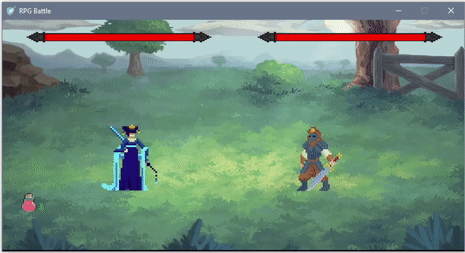

# RPG Battle Game With PyGame

> Final Fantasy Style RPG Battle Game using python and pygame

## Installation

You can install or clone the repo from github repository. In order for the game to run, python and pygame must be installed on your computer. If they are not installed, you can download them from the tag above.

## Usage Example

When you download the repo, you can run the game with the command `py main.py` in Windows.When you run the file, you will see the game screen.

You can move the priestess with `arrow keys`. The bandit only hurts you when you hit it or use potions.

And To attack the Bandit, you can damage it by `right or left click` while the mouse is on it. But remember, you can only damage or take damage within a certain distance.

When one of the bandit or priestess dies, it's game over. If you want, you can start the game again by clicking restart.

Have a nice try!

If you run into a problem, you can let me know here or on my Twitter account. - [@Mehmetkaragoz07](https://twitter.com/Mehmetkaragoz07) - karagoz.mhmtg@gmail.com

https://github.com/mehmet-karagoz